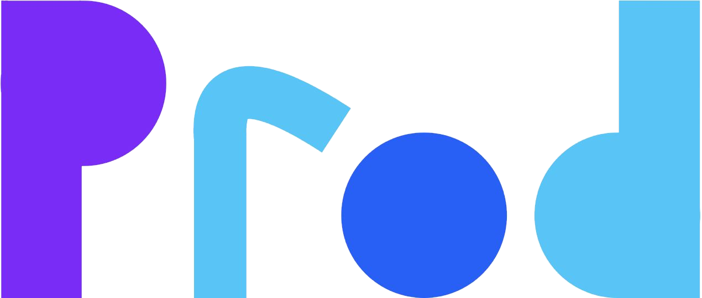
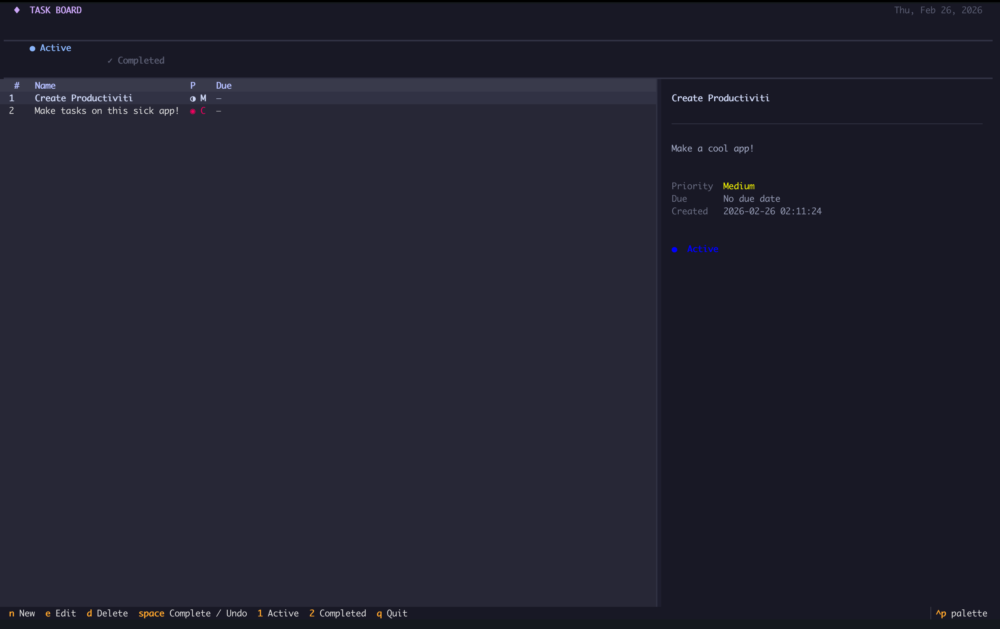

<div align="center">

<!-- Replace with your logo -->


# ◆ Task Board

**A keyboard-driven terminal UI for managing tasks — built with Python & Textual.**


---

<!-- Drop a screenshot here once you have one -->


</div>

---

## Features

- **Full CRUD** — create, edit, soft-delete and complete tasks without leaving the terminal
- **Priority system** — Low · Medium · High · Critical, each colour-coded
- **Due dates** — smart relative labels: *Today*, *Tomorrow*, *Overdue (3d)*, etc.
- **Two-pane layout** — task list on the left, rich detail view on the right
- **Active / Completed views** — switch instantly with `1` / `2` or the filter bar
- **Modal forms** — add & edit dialogs with full keyboard navigation (Tab, arrows, Enter, Escape)
- **Persistent storage** — SQLite, zero config, lives next to the project
- **Catppuccin Mocha theme** — easy on the eyes at 3 AM

---

## Installation

**Requirements:** Python 3.10+

```bash
# 1. Clone
git clone https://github.com/qr0n/productiviti.git
cd productivity

# 2. Create & activate a virtual environment (recommended)
python3 -m venv .venv
source .venv/bin/activate

# 3. Install dependencies
pip install textual
```

No other dependencies — SQLite is part of the Python standard library.

---

## Usage

```bash
python3 main.py
```

The database file (`task_board.db`) is created automatically on first run.

---

## Keybindings

| Key | Action |
|-----|--------|
| `n` | New task |
| `e` | Edit selected task |
| `d` | Delete selected task |
| `Space` | Toggle complete / reopen |
| `1` | Switch to Active view |
| `2` | Switch to Completed view |
| `q` | Quit |

**Inside modals**

| Key | Action |
|-----|--------|
| `Tab` / `Shift+Tab` | Move between fields |
| `←` / `→` | Move between buttons |
| `Enter` | Submit form |
| `Escape` | Close / cancel |

---

## Project Structure

```
productivity/
├── main.py              # TUI app (Textual)
├── styling.css          # TCSS theme (Catppuccin Mocha)
├── modules/
│   └── database.py      # SQLite data layer (TaskDB, Task)
└── tests/               # Test suite
```

---

## Data Model

| Field | Type | Notes |
|-------|------|-------|
| `id` | integer | Auto-increment primary key |
| `name` | text | Required |
| `description` | text | Required |
| `priority` | integer | 0 Low · 1 Medium · 2 High · 3 Critical |
| `created_at` | text | ISO 8601, set automatically |
| `due_date` | text | ISO 8601 date, `0` = no due date |
| `is_complete` | integer | 0 / 1 |
| `is_hidden` | integer | 0 / 1 — soft delete |
| `meta_data` | text | JSON blob, reserved for future use |

---

## Roadmap

- [ ] Search / filter tasks by name
- [ ] Sort by priority or due date
- [ ] Recurring tasks
- [ ] Export to Markdown / CSV
- [ ] Config file for custom theme colours

---

## Contributing

Pull requests are welcome. For larger changes, open an issue first to discuss what you'd like to change.

---

<div align="center">

Made with [Textual](https://github.com/Textualize/textual) &nbsp;·&nbsp; Themed with [Catppuccin Mocha](https://github.com/catppuccin/catppuccin)

</div>
